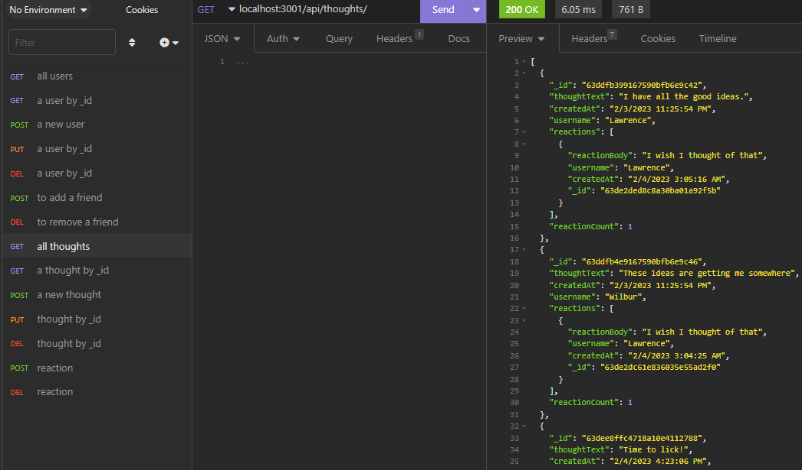

# Social API Mongoose-Based

## Description

This is the back-end for a social network website that uses [MongoDB](https://www.mongodb.com/) and [Mongoose](https://mongoosejs.com/) for [ODM](https://www.mongodb.com/developer/products/mongodb/mongodb-orms-odms-libraries/).

## Table of Contents

- [Social API Mongoose-Based](#social-api-mongoose-based)
  - [Description](#description)
  - [Table of Contents](#table-of-contents)
  - [Link to Video](#link-to-video)
  - [Installation](#installation)
  - [Usage](#usage)
  - [Questions](#questions)
  - [How to Contribute](#how-to-contribute)
  - [Tests](#tests)
  - [Credits](#credits)
  - [License](#license)

## Link to Video

[Video](https://watch.screencastify.com/v/EBSxPnbfUJ3UjzwT5lEl)

## Installation

Download the code [here](https://github.com/eljayman/18-social-api-mongoose-based), then use `npm i` to install the packages.

## Usage

This application has no client UI, and so you must use a [REST](https://restfulapi.net/) client, like [Insomnia](https://insomnia.rest/) or [Postman](https://www.postman.com/).

## Questions

If you have any questions about this application send me an email or message on github.

My email address is: [lelandoj@gmail.com](mailto:lelandoj@gmail.com)

My repo URL is: [https://github.com/eljayman/18-social-api-mongoose-based](https://github.com/eljayman/18-social-api-mongoose-based)

## How to Contribute

If you would like to contribute to this application, please contact me on github.

## Tests

If you find any errors with this application, please contact me on github.

## Credits

This application was made to run in [node.js](https://nodejs.org/) and uses [Express](expressjs.com) and [Mongoose](https://mongoosejs.com/) as dependencies.

## License

    Copyright 2022 eljayman

Permission is hereby granted, free of charge, to any person obtaining a copy of this software and associated documentation files (the "Software"), to deal in the Software without restriction, including without limitation the rights to use, copy, modify, merge, publish, distribute, sublicense, and/or sell copies of the Software, and to permit persons to whom the Software is furnished to do so, subject to the following conditions:

The above copyright notice and this permission notice shall be included in all copies or substantial portions of the Software.

THE SOFTWARE IS PROVIDED "AS IS", WITHOUT WARRANTY OF ANY KIND, EXPRESS OR IMPLIED, INCLUDING BUT NOT LIMITED TO THE WARRANTIES OF MERCHANTABILITY, FITNESS FOR A PARTICULAR PURPOSE AND NONINFRINGEMENT. IN NO EVENT SHALL THE AUTHORS OR COPYRIGHT HOLDERS BE LIABLE FOR ANY CLAIM, DAMAGES OR OTHER LIABILITY, WHETHER IN AN ACTION OF CONTRACT, TORT OR OTHERWISE, ARISING FROM, OUT OF OR IN CONNECTION WITH THE SOFTWARE OR THE USE OR OTHER DEALINGS IN THE SOFTWARE.
